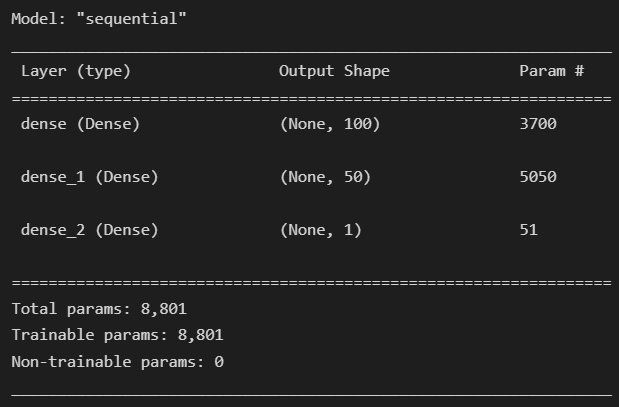

# Neural-Network-Charity-Analysis

## Overview:

The goal of this study was to investigate and develop neural networks in `Python` using `TensorFlow`. Neural networks are a type of `Machine Learning` that can detect patterns and features in a dataset. Neural networks are made up of layers of neurons that may execute independent calculations and are modelled after the human brain. Image recognition is a wonderful example of a `Deep Learning Neural Network`. The neural network will calculate, link, weigh, and deliver an encoded category result to determine whether the image represents a "dog," "cat," or something or someone else.

We learned the following during this module:

- How to Create a Simple Neural Network.
- Prepare/process the datasets.
- Make a set of training and testing materials.
- Check the model's correctness.
- To improve the model, add more neurons and hidden layers.
- Choose the best model for our dataset.

A philanthropic foundation, AlphabetSoup, is looking for a quantitative, data-driven solution to help evaluate which organisations are worthy of donations and which are "high-risk." Not every donation AlphabetSoup has made has had an impact in the past, since there have been applicants who have received funds and subsequently vanished. Beks, an AlphabetSoup data scientist, is responsible for measuring the effects of each gift and vetting the recipients to ensure that the company's funds are spent wisely. To fulfil this requirement, we must assist Beks in developing a binary classifier that can predict if an organisation will be successful in receiving money. To assess the incoming data and create unambiguous decision-making outputs, we use Deep Learning Neural Networks.

## Results:

We used a [CSV file](./Resources/charity_data.csv) that contained over 34,000 organisations that had previously received donations. This dataset contained the following information.

More than 34,000 organisations that have received support from Alphabet Soup over the years are included in this CSV. A number of columns in this dataset record metadata on each organisation, including the following:

- EIN and NAME — Identification columns.
- APPLICATION_TYPE — Alphabet Soup application type.
- AFFILIATION — Affiliated sector of industry.
- CLASSIFICATION — Government organization classification.
- USE_CASE — Use case for funding.
- ORGANIZATION — Organization type.
- STATUS — Active status.
- INCOME_AMT — Income classification.
- SPECIAL_CONSIDERATIONS — Special consideration for application.
- ASK_AMT — Funding amount requested.
- IS_SUCCESSFUL — Was the money used effectively.

## Data Preprocessing

In order to construct, train, and test the neural network model, we first had to preprocess the data. For the Data Preprocessing section, you'll need to do the following:

- During the preprocessing stage, the EIN and NAME columns were removed because they were of no use.
- The IS SUCCESSFUL column was the target variable, and we binned APPLICATION TYPE and classed all unique values with less than 500 entries as "Other."
- The remaining 43 variables (such as STATUS, ASK AMT, APPLICATION TYPE, and so on) were added as features.

## Compiling, Training and Evaluating the Model

After the data was preprocessed, we used the following parameters to compile, train, and evaluate the model as shown in the image below:

- Both the first and second hidden layers were activated using RELU - Rectified Linear Unit function. The output layer was activated using the Sigmoid function.

## Attempts to Optimize and Improve the Accuracy Rate

Three additional attempts were made to increase the model's performance by changing features, adding/subtracting neurons and epochs. The results did not show any improvement.

- Optimization Attempt #1:

  - Binned INCOME_AMT column.
  - Created 5,821 total parameters, a decrease of 160 from the original of 5,981.

  
  

- Optimization Attempt #2:

  - Removed ORGANIZATION column.
  - Binned INCOME_AMT column.
  - Removed SPECIAL_CONSIDERATIONS_Y column from features as it is redundant to SPECIAL_CONSIDERATIONS_N.
  - Increased neurons to 100 for the first hidden layer and 50 for the second hidden layer.

  
  

- Optimization Attempt #3:

  - Binned INCOME_AMT and AFFILIATION column
  - Removed SPECIAL_CONSIDERATIONS_Y column from features as it is redundant to SPECIAL_CONSIDERATIONS_N
  - Increased neurons to 125 for the first hidden layer and 50 for the second hidden layer

  
  

## Summary:

In conclusion, our model and multiple optimizations failed to produce the intended result of greater than 75%. The modifications were small and did not improve as we had hoped with the adjustments of expanding the epochs, eliminating variables, adding a 3rd hidden layer (done offline in Optimization attempt #4), and/or increasing/decreasing the neurons. Other Machine Learning algorithms did not produce any better results when tested. For example, the prediction accuracy of the `Random Forest Classifier` was similar to that of the neural network model, while the neural network model performed somewhat better.

Overall, `Neural Networks` are very intricate and would require experience through trial and error or many iterations to identify the perfect configuration to work with this dataset.

## Resources

- Software: Python 3.7.11, VSCode 1.66.2
- Libraries: Scikit-learn, Pandas, TensorFlow, Keras
